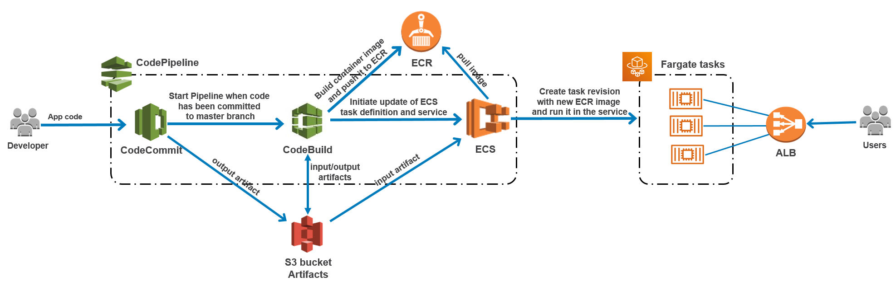
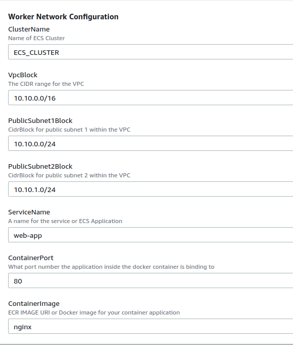
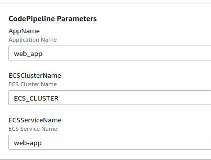

Configure ECS and CodePipeline with CloudFormation
--------------------

In this repository you can learn how to deploy a container application in ECS and automate the deployment of new releases using CodePipeline. The entire architecture is configure with CloudFormation. 

CodePipeline
------------

1. The Pipeline will run every time new code is pushed to the master branch of the CodeCommit repository 
2. CodeBuild executes the commands specified in the [buildspec.yml](buildspec.yml) file.. 
   2.1 It creates a Docker image using the [Dockerfile](Dockerfile) and tag it with the ECR repository name. 
   ```
   docker build -t web_app:latest .
   docker tag web_app:latest $ECR_URI
   ```
   2.2 The image is push to the ECR repository
   ```
   docker push $ECR_URI
   ```
   2.3 The image definition file needs to be created. 
   ```
   printf '[{"name":"%s","imageUri":"%s"}]' $ContainerDefinitionName $ECR_URI > imagedefinitions.json
   ```
   This file will be used later by ECS, so it needs to be copied to the artifact bucket
   ```
   artifacts:
     files:
       - imagedefinitions.json
    ```
3. ECS updates the service with the new task revision that it created. This task uses the container images defined in the imagedefinitions.json file
4. Users can connect to the application through the ALB configured in front of the application containers




Deployment
---------------

First, you run the template [ecs_app.yaml](ecs_app.yaml) to configure the ECS cluster, task definition and services. A new VPC, subnets, ALB and security groups are also created with this template. 

Please notice that initially you can use any Docker image (nging in this case). The application will be deployed later when the Pipepile runs. 



Then, you can create a new stack with the CodePipeline CloudFormation template [codepipeline.yaml](codepipeline.yaml).




