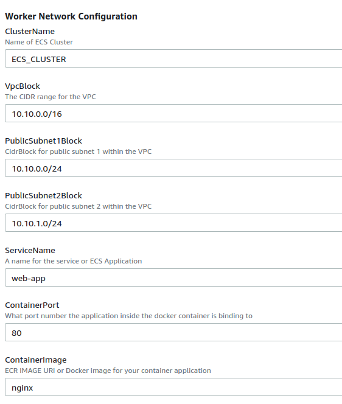
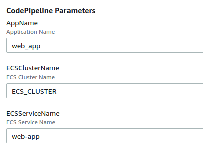

Configure ECS and CodePipeline with CloudFormation
--------------------

In this repository, I use CloudFormation to deploy a container application in ECS and automate the deployment of new releases with CodePipeline. 

CodePipeline
------------

1. The Pipeline will run every time new code is pushed to the master branch of the CodeCommit repository 
2. CodeBuild executes the commands specified in the [buildspec.yml](buildspec.yml) file </br>
   2.1 It creates a Docker image using the [Dockerfile](Dockerfile) and tag it with the ECR repository name. 
   ```
   docker build -t web_app:latest .
   docker tag web_app:latest $ECR_URI
   ```
   2.2 The image is pushed to the ECR repository
   ```
   docker push $ECR_URI
   ```
   2.3 The image definition file needs to be created 
   ```
   printf '[{"name":"%s","imageUri":"%s"}]' $ContainerDefinitionName $ECR_URI > imagedefinitions.json
   ```
   This file will be used later by ECS, so it needs to be copied to the artifact bucket
   ```
   artifacts:
     files:
       - imagedefinitions.json
    ```
3. ECS updates the service with a new task revision. This task uses the container image defined in the *imagedefinitions.json* file
4. Users can connect to the application through the ALB configured in front of the application containers


Deployment
---------------

First, you run the template [ecs_app.yaml](ecs_app.yaml) to configure the ECS cluster, task definition and service. A new VPC, subnets, ALB, role and security group are also created with this template. 

Please notice that initially you can use any Docker image (nginx in this case). The application will be deployed later when the Pipepile runs. 



Then, you can create a new stack with the CodePipeline CloudFormation template [codepipeline.yaml](codepipeline.yaml).

You need to enter the name of the ECS cluster and service configured previously. 




